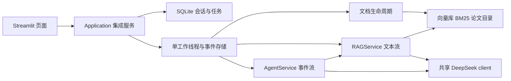

# Co-Work 前端开发与系统集成

本文规定课程模块四的前端和集成实现。输入依据为《南京农业大学课程实践》中模块四要求、仓库后端集成契约和 Agent 实际代码。课程文档中的背景数字、产品设想不作为已实现能力或实测指标。

## 已确认的产品决策

- Streamlit；本地单人；SQLite 持久化；不做账号和多用户权限。
- DeepSeek API 是唯一生成服务。Agent 和直接 RAG 复用同一个 client；模型名读取 `config/agent.yaml`。Embedding、向量库和 Reranker 保持本地后端实现。
- 参考 macOS Notes/Finder：浅色、Apple 蓝、双栏和可展开检查器。不使用 Apple 商标或装饰性的仿窗口按钮。
- 会话创建时固定模式。知识库问答独立检索并真实流式返回；智能助理保留多轮记忆并流式展示工具事件，最终答案整体返回。
- 前端负责人承担集成编排，不重复实现 BM25、RRF、Reranker 或 ReAct。

## 课程要求与对应实现

| 要求 | 实现入口 | 边界 |
| --- | --- | --- |
| 文档批量上传、状态、失败重试、删除 | 知识库页 + Documents | 每批 20 个，每文件 50MB；进度按实际阶段和文件数 |
| Markdown、流式、引用 | 工作台 + RAGStreamEvent | Agent 无 token 事件，不模拟成真实文本流 |
| 新建、切换、删除历史 | Conversations + SQLite | 单人部署；重启后可恢复 |
| 推理轨迹 | 检查器 | 按事件显示，完成后以最终 trace 为准 |
| Token、耗时、工具成功率 | 系统状态 + 回答检查器 | 缺失值显示未提供；不把 RAG 总耗时称为纯检索耗时 |
| 健康检查 | 配置摘要 + 主动探测 | 配置存在不等于服务连接成功 |
| 端到端联调 | application 测试 + 手工真实链路 | 离线替身测试与真实模型测试分别记录 |

## 架构



`app.py` 为入口。`src/frontend` 放页面、组件、界面状态和样式；`src/application` 放配置组装、公共契约、文档生命周期、会话、后台运行和持久化。模型懒加载，界面重绘复用缓存的 Application，后台不调用 Streamlit API。

保留 Agent 原有三个 HTTP 接口；首版 UI 直接消费 Python 服务，不要求额外启动 FastAPI。对既有 Agent 工厂仅增加可选 client 包装钩子和 `rag_service` 组合句柄，不改变默认请求、事件或响应格式。

## 数据生命周期

默认使用 `data/workspace/`，可通过 `COWORK_DATA_DIR` 指向独立绝对路径。该目录包含原文件、SQLite、向量索引和 manifest；不混用课程样本索引。数据库持久化完整会话消息与 Agent 压缩记忆。

文档内容哈希为标识。相同内容跳过；同名异内容独立保存。所有问答、导入、删除、修复与连接检测经过同一个操作门，操作进行中拒绝新的相冲突请求。导入/删除更新向量库、BM25、论文目录及知识库版本，再释放门。缓存绑定版本并随服务快照重建失效。

更新前标记 dirty，失败时保留可修复状态。启动把未结束运行标记为中断；首次实际使用或显式修复时清理中断导入、完成待删除任务并恢复索引。未成功恢复前不运行问答。删除文档保留历史回答及引用快照，原文件下载显示不可用。

## 分阶段工作与验证

1. **设计交付**：本文、接口契约、设计规范；六个 HTML 场景和 PNG。
2. **页面**：工作台、文档管理、论文分析、系统状态；模拟展示只存在原型，不混入真实应用数据。
3. **集成**：共享 DeepSeek、安全错误包装、持久化、任务互斥、导入删除一致性。
4. **联调**：RAG metadata/token/error/end、Agent 七类事件、引用快照、会话恢复。
5. **验证**：离线测试、Streamlit AppTest、浏览器检查、显式真实调用；记录实际结果与未验证项。

验收必须覆盖：重复内容、同名异内容、部分失败、超限、删除一致性、缺页码、缺 Token、断流保留文本、最大迭代、工具失败后继续、长记忆持久化、界面重绘不重复提交、DeepSeek 401/429/超时提示及无 OpenAI 意外调用。

不包含账号、多人并发、移动端专项适配、Agent 最终文本真流式、完整在线评测平台。原有论文对比工具仅比较已提取结构化字段，无法据此宣称已完成论文方法的深度分析；用户可另发知识库问答获取原文证据。

## 运行

推荐 Python 3.11 或 3.12，安装全部项目依赖：

```bash
python3.11 -m venv .venv
.venv/bin/python -m pip install -r requirements.txt
export DEEPSEEK_API_KEY='在本机设置真实密钥'
.venv/bin/streamlit run app.py
```

不在页面填密钥，不将命令示例中的占位符当成有效 Key。模型与 API 地址在 `config/agent.yaml` 配置。首次导入可能下载 Embedding/Reranker；资源未安装或网络受限会形成可重试的失败任务。服务默认绑定 127.0.0.1。

启动后先打开系统状态，检查配置并主动测试连接；上传一篇可解析论文，等待已就绪后，在两个模式分别发起问题，检查引用页码与原文。

查看原型：直接打开 `prototype/index.html`，顶部切换六个场景。重新导出需要 Node、Playwright 和 Chrome，执行 `node docs/frontend/prototype/render.mjs`。通过 `PLAYWRIGHT_MODULE` 可指定现有 Playwright 包路径。
